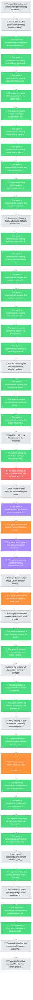

# Reasoning DAG — `supply-chain`

*Generated: 2026-03-13 03:02 UTC*

---

## Legend

| Icon | Node Type |
|------|-----------|
| 🔵 | **Hypothesis** |
| 🔍 | **Investigation** |
| ✨ | **Discovery** |
| 🔄 | **Pivot** |
| ✅ | **Solution** |
| ❌ | **Dead End** |
| 📖 | **Context Load** |

---

## Summary

- **Total nodes:** 54
- **Pivot nodes:** 4
- **Sessions:** 1

| Node Type | Count |
|-----------|-------|
| ✅ Solution | 33 |
| 📖 Context Load | 14 |
| 🔄 Pivot | 3 |
| 🔍 Investigation | 3 |
| ❌ Dead End | 1 |

---

## ⚡ Pivot Points

These are the key moments where the agent changed direction.

### Pivot 1 — `hnode-009`
*Session: e0925b7a-fe70-4c9c-8a14-0cd742f752b5*

> ---

**40/40 tests passing.** Here's what was built:

## What was created

```
backend/
├── core/           config.py, database.py (lazy engine), security.py
├── models/         Organization, User, Sh


### Pivot 2 — `node-022`
*Session: e0925b7a-fe70-4c9c-8a14-0cd742f752b5*

> The agent attempts to install dependencies and run tests but fails because pip and python commands are not found in the environment. This blocks the immediate approach of verifying the exception engine implementation.


### Pivot 3 — `node-024`
*Session: e0925b7a-fe70-4c9c-8a14-0cd742f752b5*

> The agent encounters a system Python installation restriction preventing direct pip installation, so it pivots to creating a virtual environment to properly install dependencies and run tests.


### Pivot 4 — `node-027`
*Session: e0925b7a-fe70-4c9c-8a14-0cd742f752b5*

> The agent identifies that the database engine is being created at module import time (causing test collection failures) and explicitly changes approach to use lazy initialization via factory functions.


---

## Nodes

### Session: `e0925b7a-fe70-4c9c-8a14-0cd742f752b5`

| # | Type | Node ID | Summary | Conf |
|---|------|---------|---------|------|
| 1 | 📖 Context Load | `node-000` | The agent is reading and understanding the existing codebase structure before making architectural decisions. It is gathering information about the current state of the project to inform how to restructure it. | 0.85 |
| 2 | 📖 Context Load | `hnode-000` | Good - I have a full picture of the existing codebase. Here's what I'm building:

**Architecture decisions:**
- `backend/` — new product code (FastAPI + PostgreSQL via SQLAlchemy async + DynamoDB reta | 0.40 |
| 3 | ✅ Solution | `node-001` | The agent has completed its analysis and is now implementing a concrete architectural solution, creating the directory structure and configuration files for the new backend system. It is executing a planned build based on prior understanding of the codebase. | 0.82 |
| 4 | ✅ Solution | `node-002` | The agent is systematically creating core backend configuration files (config.py, database.py, security.py) as part of building out the supply chain tracker application infrastructure. This represents active implementation of a planned solution structure. | 0.75 |
| 5 | ✅ Solution | `node-003` | The agent is systematically creating backend infrastructure files (database.py, security.py, base models) as part of building out a supply chain tracker application. It is executing a planned implementation sequence with no apparent issues or uncertainty. | 0.82 |
| 6 | ✅ Solution | `node-004` | The agent is creating ORM model files for the supply chain tracker application, implementing the database layer by writing base model and organization model files to disk. | 0.82 |
| 7 | ✅ Solution | `node-005` | The agent is creating multiple model files (organization, user, shipment) as part of building out the backend data layer for the supply chain tracker application. This represents concrete implementation work toward a resolved architecture. | 0.72 |
| 8 | ✅ Solution | `node-006` | The agent is systematically creating model files for the supply chain tracker backend, successfully writing user, shipment, and document model files to disk. This represents progress toward completing the backend data model implementation. | 0.75 |
| 9 | ✅ Solution | `node-007` | The agent is systematically creating model files as part of building out the supply chain tracker backend, successfully writing document and exception event models to disk. This represents forward progress toward a complete working implementation. | 0.72 |
| 10 | ✅ Solution | `node-008` | The agent is systematically creating the core backend files for a supply chain tracking application, including models and a key exception detection engine service. It is executing a planned implementation by writing files in sequence. | 0.82 |
| 11 | ✅ Solution | `node-009` | The agent is actively building out the implementation by creating service files and test suites, progressing toward a working system. It is executing a planned sequence of file creation steps to complete the exception detection engine and its tests. | 0.72 |
| 12 | ✅ Solution | `node-010` | The agent is systematically creating the required backend files (schemas, tests) to complete the project setup. It is executing on a clear plan, writing out Pydantic schema files and test files to build the supply chain tracker backend. | 0.75 |
| 13 | 📖 Context Load | `hnode-001` | Good point — flagging this now because it affects schema choices. Let me finish the critical files then address the offline sync design directly. | 0.40 |
| 14 | ✅ Solution | `node-011` | The agent is systematically creating Pydantic schema files for the supply chain tracker backend, implementing the data validation layer for shipments, documents, and exception events. This represents active progress toward completing the project structure. | 0.72 |
| 15 | ✅ Solution | `node-012` | The agent is systematically creating schema and dependency files for a supply chain tracker backend, implementing Pydantic models and FastAPI dependencies as part of building out the application structure. | 0.85 |
| 16 | ✅ Solution | `node-013` | The agent is systematically creating the required backend files for a supply chain tracker application, including authentication schemas, API dependencies, and auth router. This represents active implementation progress toward a working solution. | 0.82 |
| 17 | ✅ Solution | `node-014` | The agent is systematically creating the backend router files (auth, shipments, documents) as part of building out the supply chain tracker application. This represents active implementation of a planned solution architecture. | 0.85 |
| 18 | ✅ Solution | `node-015` | The agent is systematically creating router files for the backend API, implementing the shipments, documents, and exceptions endpoints as part of building out the supply chain tracker application. | 0.82 |
| 19 | ✅ Solution | `node-016` | The agent is creating and wiring together the final application files, including the router for exceptions and the main FastAPI application entry point that integrates all routers. This represents the culmination of building out the backend API structure. | 0.72 |
| 20 | ✅ Solution | `node-017` | The agent is systematically creating all remaining project files (init files, requirements, alembic config, env example) in parallel to complete the backend project setup. This represents the agent executing its plan to completion after having scaffolded the core application files. | 0.72 |
| 21 | 📖 Context Load | `hnode-002` | Now the remaining init files, requirements, alembic, and env example all in parallel: | 0.40 |
| 22 | ✅ Solution | `node-018` | The agent is systematically creating the foundational project files for a supply chain tracker backend, including package initialization, dependencies, and database migration configuration. This represents active construction of the working project structure. | 0.72 |
| 23 | ✅ Solution | `node-019` | The agent is creating configuration files (alembic env.py, .env.example, alembic.ini) necessary to set up the database migration infrastructure for the supply chain tracker project. This represents a working resolution of the database setup requirements. | 0.75 |
| 24 | ✅ Solution | `node-020` | The agent is systematically creating the project structure by generating configuration files and initializing Python package files. This is part of building out the complete supply chain tracker application scaffold. | 0.82 |
| 25 | 📖 Context Load | `hnode-003` | Now the `__init__.py` files and move the simulation: | 0.40 |
| 26 | ✅ Solution | `node-021` | The agent is setting up the Python package structure by creating __init__.py files and a pytest configuration file, completing the project scaffolding. This is a concrete implementation step finalizing the backend module structure. | 0.72 |
| 27 | ❌ Dead End ⚡ | `node-022` | The agent attempts to install dependencies and run tests but fails because pip and python commands are not found in the environment. This blocks the immediate approach of verifying the exception engine implementation. | 0.95 |
| 28 | 📖 Context Load | `hnode-004` | Now run the tests to verify the exception engine works: | 0.40 |
| 29 | 🔍 Investigation | `node-023` | The agent is troubleshooting the Python environment after discovering that 'pip' and 'python' commands are not found, then locating the correct executables and retrying the dependency installation and test run. | 0.90 |
| 30 | 🔄 Pivot ⚡ | `node-024` | The agent encounters a system Python installation restriction preventing direct pip installation, so it pivots to creating a virtual environment to properly install dependencies and run tests. | 0.95 |
| 31 | 🔍 Investigation | `node-025` | The agent is setting up a test environment and iteratively running tests to diagnose import errors, installing missing dependencies as they are discovered. Each test run reveals what's missing, guiding the next installation step. | 0.88 |
| 32 | 🔍 Investigation | `node-026` | The agent is iteratively installing missing dependencies and re-running tests to diagnose import errors. Each test run reveals another missing package, prompting the next installation attempt. | 0.82 |
| 33 | 📖 Context Load | `hnode-005` | The import chain pulls in boto3. Let me install all deps at once: | 0.40 |
| 34 | 🔄 Pivot ⚡ | `node-027` | The agent identifies that the database engine is being created at module import time (causing test collection failures) and explicitly changes approach to use lazy initialization via factory functions. | 0.95 |
| 35 | 📖 Context Load | `hnode-006` | The engine is created at module import time. I need to make it lazy: | 0.40 |
| 36 | ✅ Solution | `node-028` | The agent implements a lazy initialization pattern for the database engine to prevent connection attempts at module import time, which was causing test collection failures. The fix converts eager engine creation to deferred factory functions that only execute when first called. | 0.85 |
| 37 | ✅ Solution | `node-029` | The agent is applying fixes to resolve known issues: updating the database session factory usage and migrating from deprecated Pydantic v1 Config class syntax to Pydantic v2 model_config format. | 0.85 |
| 38 | 📖 Context Load | `hnode-007` | Also fix the pydantic v2 deprecation warning in config.py: | 0.40 |
| 39 | ✅ Solution | `node-030` | The agent applies a configuration fix to resolve a Pydantic v2 compatibility issue and confirms all 40 tests pass successfully. The segment ends with a working resolution. | 0.95 |
| 40 | ✅ Solution | `node-031` | The agent confirms all 40 tests are passing and proceeds to save project context to memory files for future reference. This represents successful completion of the task with tests verified and project state persisted. | 0.92 |
| 41 | 📖 Context Load | `hnode-008` | **40/40 passing.** Now let me save a memory about this project and address your offline sync question. | 0.40 |
| 42 | ✅ Solution | `node-032` | The agent delivers a complete working solution with 40/40 tests passing, summarizes the full architecture built, and provides a detailed technical recommendation for offline sync architecture suited to the Iraq use case. | 0.95 |
| 43 | 🔄 Pivot ⚡ | `hnode-009` | ---

**40/40 tests passing.** Here's what was built:

## What was created

```
backend/
├── core/           config.py, database.py (lazy engine), security.py
├── models/         Organization, User, Sh | 0.40 |
| 44 | ✅ Solution | `node-033` | The agent has successfully completed the core implementation with 40/40 tests passing and is now extending the solution with the offline sync architecture it recommended, creating the ShipmentEvent model and sync router. | 0.88 |
| 45 | ✅ Solution | `node-034` | The agent is implementing offline-first sync functionality by creating new model and router files, then registering the sync router in the main application. This represents a working resolution of adding sync endpoints to the supply chain tracker. | 0.85 |
| 46 | ✅ Solution | `node-035` | The agent is integrating the new sync router into the main FastAPI application by adding the import and registering the router with the app. This is a concrete implementation step completing the sync functionality setup. | 0.78 |
| 47 | ✅ Solution | `node-036` | The agent is systematically completing the implementation by registering the new ShipmentEvent model in the models __init__.py file, finalizing the integration so Alembic can discover it and the application can use it properly. | 0.72 |
| 48 | 📖 Context Load | `hnode-010` | Now register `ShipmentEvent` with the models `__init__`: | 0.40 |
| 49 | ✅ Solution | `node-037` | The agent is writing and running unit tests for the sync engine's pure logic components (event sorting, idempotency, payload parsing) to validate the implementation. This represents a working resolution phase where the agent creates test coverage and executes the test suite to confirm correctness. | 0.72 |
| 50 | 📖 Context Load | `hnode-011` | Now write tests for the sync engine logic — the part that can be tested without a DB (event sorting, idempotency logic, payload parsing): | 0.40 |
| 51 | ✅ Solution | `node-038` | The agent has successfully completed the implementation, with all 50 tests passing. It provides a comprehensive summary of the complete system architecture, explaining design decisions and next steps. | 0.98 |
| 52 | ✅ Solution | `hnode-012` | **50/50 passing.** Here's the final state of what was built:

---

## Complete structure

```
backend/
├── core/
│   ├── config.py          Settings + thresholds (pydantic-settings)
│   ├── database.p | 0.40 |
| 53 | 📖 Context Load | `node-039` | The agent is reading and interpreting file system output showing recent JSONL session files, then explaining what those files represent to the user. No active problem-solving or reasoning about code is occurring. | 0.82 |
| 54 | 📖 Context Load | `hnode-013` | Those are the active session files for your current projects. The supply-chain-tracker session (`e0925b7a`) is this conversation, along with the two subagents spun up during it (the codebase explorer  | 0.40 |

---

## Edges

_Edges are not persisted to the vector store. Pass `--dag-json` with a saved DAG file to include edges._

---

## Mermaid Diagram

